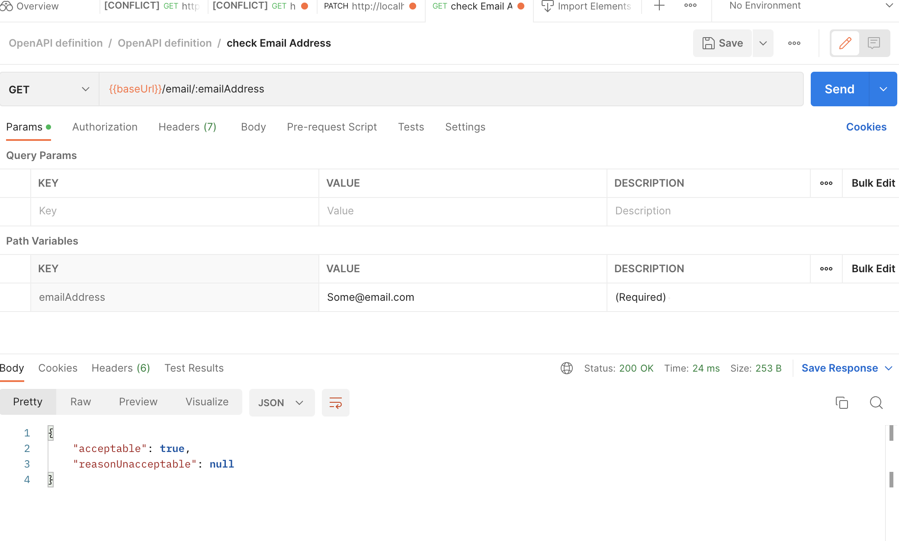
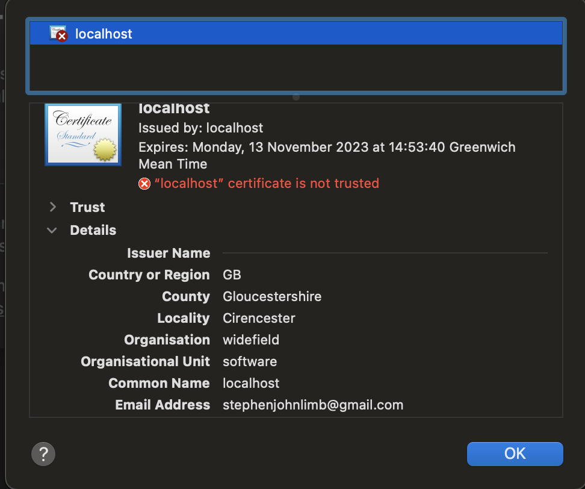
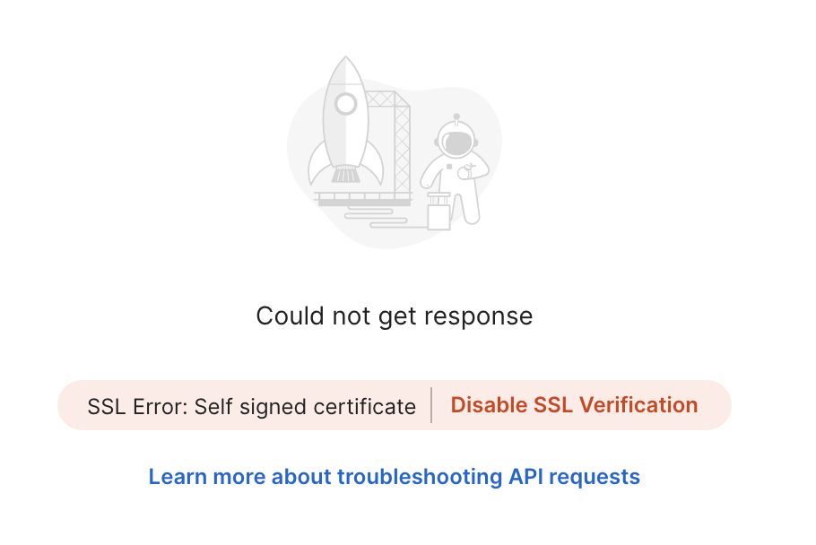
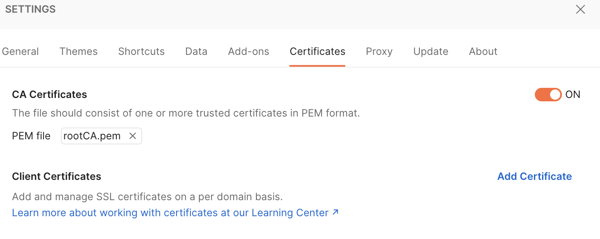
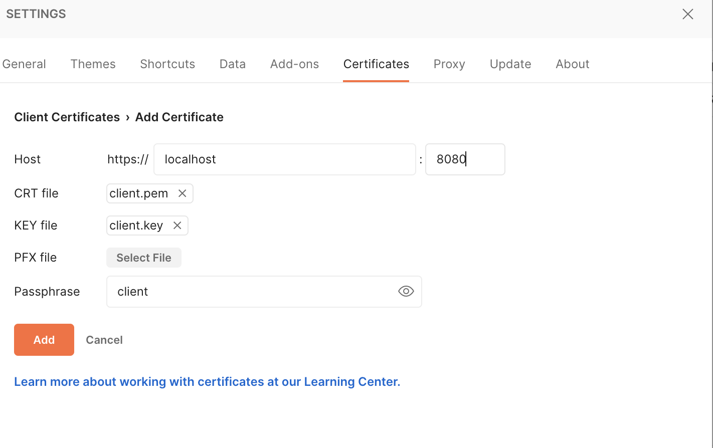

## Adding in mutual TLS
I thought I'd see what was involved in adding mutual TLS support into
the Spring Boot application and then trying it via POSTMAN.

So firstly we'll need some certificates and keys. Now as this is just a standalone
example I'll put these in a keystore in this repo and make the keys obvious.

But when doing this for real you'd pull all of this out and do it at an
'operations level'. Well away from 'developers'!

### Create a root certificate

First we need to create a private key:
```
cd src/main/resources/tls
openssl genrsa -des3 -out rootCA.key 2048

# Enter a passphrase - I used 'stevelimb' but pick something better

# Now create the root certificate
openssl req -x509 -new -nodes -key rootCA.key -sha256 -days 1825 -out rootCA.pem

# You'll get a prompt - enter stevelimb - or whatever you used for the passphrase
# Enter pass phrase for rootCA.key:

# You then get prompted to enter some details - I enters the following:
-----
Country Name (2 letter code) []:GB
State or Province Name (full name) []:Gloucestershire
Locality Name (eg, city) []:Cirencester
Organization Name (eg, company) []:widefield
Organizational Unit Name (eg, section) []:software
Common Name (eg, fully qualified host name) []:localhost
Email Address []:stephenjohnlimb@gmail.com
```

### Now let's do a server certificate

We will need a server key first for our certificate.
```
openssl genrsa -des3 -out server.key 2048

# For the passphrase I used 'stevelimb' again

# Next we need to create a certificate signing request

openssl req -new -sha256 -key server.key -out server.csr

# You'll be prompted to provide lots of details again:
Country Name (2 letter code) []:GB
State or Province Name (full name) []:Gloucestershire
Locality Name (eg, city) []:Cirencester
Organization Name (eg, company) []:widefield
Organizational Unit Name (eg, section) []:software
Common Name (eg, fully qualified host name) []:localhost
Email Address []:stephenjohnlimb@gmail.com

Please enter the following 'extra' attributes
to be sent with your certificate request
A challenge password []:stevelimb

```

### Signing the certificate request with the root CA

Now we have the request - we must sign that with the root as the
root certificate authority.

```
openssl x509 -req -in server.csr -CA rootCA.pem -CAkey rootCA.key -CAcreateserial -out server.pem -days 365 -sha256

# You'll now get some details out and be asked to provide the passphrase 'stevelimb'

Signature ok
subject=/C=GB/ST=Gloucestershire/L=Cirencester/O=widefield/OU=software/CN=localhost/emailAddress=stephenjohnlimb@gmail.com
Getting CA Private Key
Enter pass phrase for rootCA.key:
```

### Taking stock
So we're now in the situation where we could deploy the root cert and the server cert on a server.
We'd have https (tls configured and available).

But we want mutual tls, so we must also generate a key and a certificate to give to our clients.

### Generating the client certificate request
```
openssl genrsa -des3 -out client.key 2048
# Again we'd be asked for a passphrase - this time I've used the work 'client'

# Now a certificate signing request for the client
openssl req -new -sha256 -key client.key -out client.csr

# As before we enter some details
-----
Country Name (2 letter code) []:GB
State or Province Name (full name) []:Gloucestershire
Locality Name (eg, city) []:Cirencester
Organization Name (eg, company) []:widefield
Organizational Unit Name (eg, section) []:software
Common Name (eg, fully qualified host name) []:localhost
Email Address []:stephenjohnlimb@gmail.com

Please enter the following 'extra' attributes
to be sent with your certificate request
A challenge password []:client
```

### Signing the request to create the client certificate

```
openssl x509 -req -in client.csr -CA rootCA.pem -CAkey rootCA.key -CAcreateserial -out client.pem -days 365 -sha256

# Remember use the Root CA pass phrase - stevelimb
Signature ok
subject=/C=GB/ST=Gloucestershire/L=Cirencester/O=widefield/OU=software/CN=localhost/emailAddress=stephenjohnlimb@gmail.com
Getting CA Private Key
Enter pass phrase for rootCA.key:
```

### Key and Certificate generation complete

We should now have the following files available:
```
ls -l
total 72
-rw-r--r--  1 stevelimb  staff  1115 Nov 13 14:59 client.csr
-rw-r--r--  1 stevelimb  staff  1743 Nov 13 14:57 client.key
-rw-r--r--  1 stevelimb  staff  1363 Nov 13 15:01 client.pem
-rw-r--r--  1 stevelimb  staff  1751 Nov 13 14:40 rootCA.key
-rw-r--r--  1 stevelimb  staff  1363 Nov 13 14:43 rootCA.pem
-rw-r--r--  1 stevelimb  staff    17 Nov 13 15:01 rootCA.srl
-rw-r--r--  1 stevelimb  staff  1119 Nov 13 14:50 server.csr
-rw-r--r--  1 stevelimb  staff  1743 Nov 13 14:48 server.key
-rw-r--r--  1 stevelimb  staff  1363 Nov 13 14:53 server.pem
```

### Run up the existing SpringBoot app
If you now start the main application that has been developed you can test the normal
http end point - use a browser and enter `http://localhost:8080/status/SteveLimb`

You will get back:
```
{"acceptable":true,"reasonUnacceptable":null}
```

You can do the same in `postman` as shown below: 

#### Adding the certificates and keys to a key store
So that SpringBoot can pick up and load these serverside certs and keys we need
to add them to a 'keystore'.

```
openssl pkcs12 -export -in server.pem -out ../keystore.p12 -name server -nodes -inkey server.key

# You will be prompted for the passphrase - so enter 'stevelimb' or whatever you used.
# Now you will also be asked for a new password for exporting - I've used 'stephen' for that.
# You will need this later when configuring the SpringBoot app - so make a note of it.
```

But see later - because we need to ensure the root CA is available Spring as well.

### Update application.properties to enable SSL

Firstly stop your application if it is running.

Now modify `application.properties` as follows:
```
server.ssl.enabled=true
server.ssl.key-store=classpath:keystore.p12
server.ssl.key-store-password=stephen
server.ssl.key-store-type=PKCS12
```

#### Devops needed for production and other environments
Now this is where your 'devops' team comes in! You cannot really bundle passwords and keystores
into an application like this for production. You 'devops' staff will need to
take control of this and coordinate and cycle certificates and keys. They will also need
to 'mount' file systems and 'secrets' at run time.

#### Self signed certificate errors

If you now start the SpringBoot application; it will now serve https on 8080.
But it will be using our self-signed certificates, so if you use a browser you'll see the
following error: 

You will get the same sort of error if you use 'postman':



If you use `curl` you will see similar errors

```
curl -v --cacert ./rootCA.pem https://localhost:8080/status/Steve

curl: (60) SSL certificate problem: self signed certificate
More details here: https://curl.se/docs/sslcerts.html

curl failed to verify the legitimacy of the server and therefore could not
establish a secure connection to it. To learn more about this situation and
how to fix it, please visit the web page mentioned above.

```

If you use the following flags you can then access:
```
curl --insecure --cacert ./rootCA.pem https://localhost:8080/status/Steve
{"acceptable":true,"reasonUnacceptable":null}
```


### Adding in our self-signed root certificate

Now if you're used to 'postman' their sort of weird UI may make sense to you (no offence).
Personally I struggled a bit here.

We need to add the root CA that is self-signed into 'postman'.

So in 'postman' go to 'settings' ('preferences' on a mac) and then navigate to
'Certificates': 

So, once you've done this you can then resend in your https request to our SpringBoot app.
Now it will fail again; and you'll become slightly irritated!

Basically, 'postman' is trying to verify the certificate and has realized it is self-signed, there is a
check-box that you can check to disable and allow self-signed certificates (in the output area - see above).

## So now we have enabled https in SpringBoot
But only normal https that uses a self-signed certificate. Now we wanted to enable
mutual TLS; so we need to enable that in our application first.

Go to `application.properties` and add in the client auth part:
```
server.ssl.enabled=true
server.ssl.client-auth=need
server.ssl.key-store=classpath:keystore.p12
server.ssl.key-store-password=stephen
server.ssl.key-store-type=PKCS12
```

Restart the SpringBoot application and try postman or curl again and the SSL protocol
will report a failure.

In 'postman' you'll just get: `Error: socket hang up`.

But in CURL - with verbose on you'll get this:
```
curl -v --insecure --cacert ./rootCA.pem https://localhost:8080/status/Steve
*   Trying 127.0.0.1:8080...
* Connected to localhost (127.0.0.1) port 8080 (#0)
* ALPN, offering h2
* ALPN, offering http/1.1
* successfully set certificate verify locations:
*  CAfile: ./rootCA.pem
*  CApath: none
* (304) (OUT), TLS handshake, Client hello (1):
* (304) (IN), TLS handshake, Server hello (2):
* (304) (IN), TLS handshake, Unknown (8):
* (304) (IN), TLS handshake, Request CERT (13):
* (304) (IN), TLS handshake, Certificate (11):
* (304) (IN), TLS handshake, CERT verify (15):
* (304) (IN), TLS handshake, Finished (20):
* (304) (OUT), TLS handshake, Certificate (11):
* (304) (OUT), TLS handshake, Finished (20):
* SSL connection using TLSv1.3 / AEAD-AES256-GCM-SHA384
* ALPN, server did not agree to a protocol
* Server certificate:
*  subject: C=GB; ST=Gloucestershire; L=Cirencester; O=widefield; OU=software; CN=localhost; emailAddress=stephenjohnlimb@gmail.com
*  start date: Nov 13 14:53:40 2022 GMT
*  expire date: Nov 13 14:53:40 2023 GMT
*  issuer: C=GB; ST=Gloucestershire; L=Cirencester; O=widefield; OU=software; CN=localhost; emailAddress=stephenjohnlimb@gmail.com
*  SSL certificate verify result: self signed certificate (18), continuing anyway.
> GET /status/Steve HTTP/1.1
> Host: localhost:8080
> User-Agent: curl/7.79.1
> Accept: */*
> 
* LibreSSL SSL_read: error:1404C412:SSL routines:ST_OK:sslv3 alert bad certificate, errno 0
* Closing connection 0
curl: (56) LibreSSL SSL_read: error:1404C412:SSL routines:ST_OK:sslv3 alert bad certificate, errno 0
```
#### How to fix

Firstly we need to ensure our Spring application has the root CA; so it can validate
any incoming client certificates.

```
keytool -import -file rootCA.pem -alias rootCA -keystore truststore.p12

# You'll need to provide a new password - I've used 'stephen' again
# Also you need to review the cert and say you want to trust it.

Owner: EMAILADDRESS=stephenjohnlimb@gmail.com, CN=localhost, OU=software, O=widefield, L=Cirencester, ST=Gloucestershire, C=GB
Issuer: EMAILADDRESS=stephenjohnlimb@gmail.com, CN=localhost, OU=software, O=widefield, L=Cirencester, ST=Gloucestershire, C=GB
Serial number: ad19f63e03dccd97
Valid from: Sun Nov 13 14:43:47 GMT 2022 until: Fri Nov 12 14:43:47 GMT 2027
Certificate fingerprints:
         SHA1: AA:C1:46:AA:91:27:19:CD:BB:D1:CD:E2:4A:1F:FA:D0:DB:CC:34:68
         SHA256: 7F:6D:DC:B1:6C:A0:C2:EC:7E:97:6E:39:27:47:E3:63:41:94:52:C6:4A:09:4C:78:B3:C6:E5:3E:61:73:EE:E6
Signature algorithm name: SHA256withRSA
Subject Public Key Algorithm: 2048-bit RSA key
Version: 1
Trust this certificate? [no]:  yes
Certificate was added to keystore
```

Now we have to modify our `application.properties` again - add in the 'trust-store':

```
server.ssl.enabled=true
server.ssl.client-auth=need
server.ssl.key-store=classpath:keystore.p12
server.ssl.key-store-password=stephen
server.ssl.key-store-type=PKCS12
server.ssl.trust-store=classpath:truststore.p12
server.ssl.trust-store-password=stephen
server.ssl.trust-store-type=PKCS12
```

Once the service is running again we can try curl.

```
curl --insecure --cacert ./rootCA.pem --cert ./client.pem --key ./client.key https://localhost:8080/status/Steve

# You will be prompted for the pass phrase for the client key - which I set as 'client'

# Now the response via mutual tls!
{"acceptable":true,"reasonUnacceptable":null}%
```

On we go back to postman, bring up the settings and certificates dialog we had before.
Now we can the client cert, key and passphrase in.



Now when we submit our requests via postman we get mutual end point authentication via
TLS (SSL).

## Summary

Well, we had to generate:
- The root certificate authority key and cert
- The server certificate signing request, key and cert
- The client certificate signing request, key and cert
- Import the server certificate into a java keystore (for Spring/Java)
- Import the root CA certificate into a trust store so that the Spring app could validate the client certificate.

Then we had to configure 'postman' on the client-side to use the provided rootCA cert
and the generated client cert/key and passphrase.

### What haven't we done?

Well putting all these key certs and the like in a repository is a very bad idea.
But just so anyone can pick this up and try it, it's fine. But you've never do this
in full development. Neither would you store use names/passwords. These must be injected
just prior to running up the application - via some secrets store.


