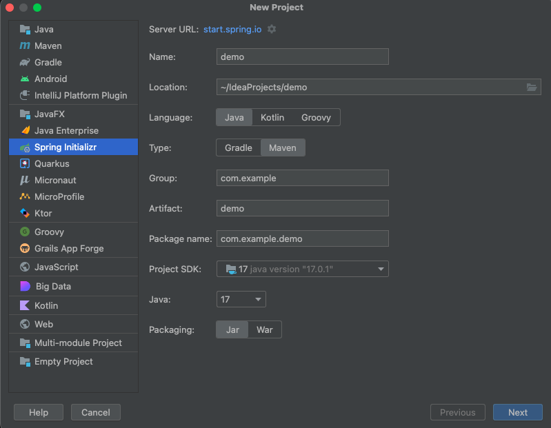
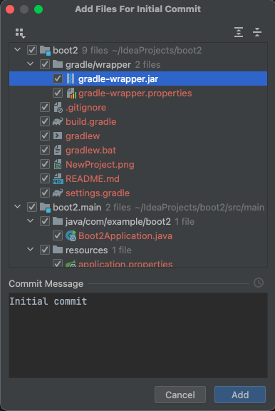

## Simple SpringBoot App with Gradle

### How did this project get created

I used IntelliJ with the `Spring Boot / Spring Initializr project wizard` plugin.

This means I can just use: `File -> New -> Project` and then use the following dialog to create the project.

#### IntelliJ Spring Initializr dialog

#### Project Settings
I didn't really need to do anything to alter this project, other than write these few notes.

### So what now?

Well first you can just use the IntelliJ `Build -> Rebuild Project` or you can use the `Gradle view` to
trigger builds. Finally, it is also possible to use the `Terminal` to issue direct gradle commands.

#### Gradle commands
I find this approach most useful; because I'm used to CLI in general. You can just the following to test the
default SpringBoot app context loads: `./gradlew clean test --info`.

This will give you quite a bit of information and also show that you Spring boot app runs up OK (which it should as it is minimal).

### Pushing to GitHub

So this new project only exists on this laptop at present, so now I'll export it up to my GitHub repo.
Then I can work on it from various computers.

#### How to export a project
First off you'll need a GitHub account and have that setup in IntelliJ (or other IDE).
I use the token mechanism that works well GitHub and IntelliJ.

See the `VCS -> Share Project on GitHub` option, you will be prompted with a dialog like this below:

### Profiles and Conditional Beans

See [Profiles and Beans](ProfilesAndBeans.md) on a simple way to conditionally use different beans.
But note this is really only useful in very simple situations. If you need lots of conditional beans
for a variety of situations things are going to get complex. You may need to read
[Avoiding Profiles](https://reflectoring.io/dont-use-spring-profile-annotation/) as this outlines the issues
relating to just using profiles.

## On to Actual Development

See [Agile Development](AgileDevelopment.md) for how I'm going to approach adding in functionality to this simple app.

